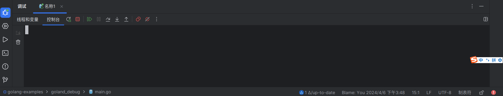

# Goland的debug使用

## 1.编写程序，[添加配置]

## 2.选择[Go构建]

## 3.填写运行文件和所在目录

## 4.点击[运行]测试

这样就可以运行起来了。

## 5.添加断点，点击[调试]

调试启动后，在我们的断点处阻塞到。此时这一行还没有运行。

## 6.点击[步过]

第1个断点所在的行被执行，a被赋值10。

程序阻塞在第2个断点。

可以继续点击[步过]，进行接下来的调试。

## 7.[停止调试]

## 8.[重新调试]

# 调试命令

## 步过（Step Over）

- 当执行到某行代码时，如果该行代码是一个方法调用，**步过命令会执行整个方法，并在方法执行完毕后停在下一行代码**。这样，程序员可以观察方法调用的结果，而无需进入方法内部进行调试。
- 这个命令常用于调试过程中不想进入调用的方法体的情况，特别是当方法体内部较为复杂或者已知没有错误时。

## 步入（Step Into）

- 与步过不同，**步入命令会进入当前行代码的方法内部，逐行执行并调试方法内的代码**。这对于理解和调试自定义方法内部逻辑非常有用。
- 步入命令通常用于需要深入查看方法内部实现细节的情况，帮助程序员理解方法的执行流程以及可能存在的问题。

当`str := strconv.Itoa(a)`的所有调用都结束的时候，就会跳回来。

## 步出（Step Out）

- 当使用步入命令进入方法内部进行调试时，**如果需要返回到调用该方法的地方**，可以使用步出命令。步出命令会执行完当前方法剩余的代码，并返回到上一层方法或调用处。
- 这个命令有助于在调试过程中快速返回到上一层调用，避免反复进入和退出方法内部。

比如当前在`return small(int(i))`

点击[步出]，会跳回到调用处 `return FormatInt(int64(i), 10)`

## 表达式求值

## 控制台

这里可以看到程序的输出，还可以清除前面的输出

## 忽略断点

忽略但不删除断点

