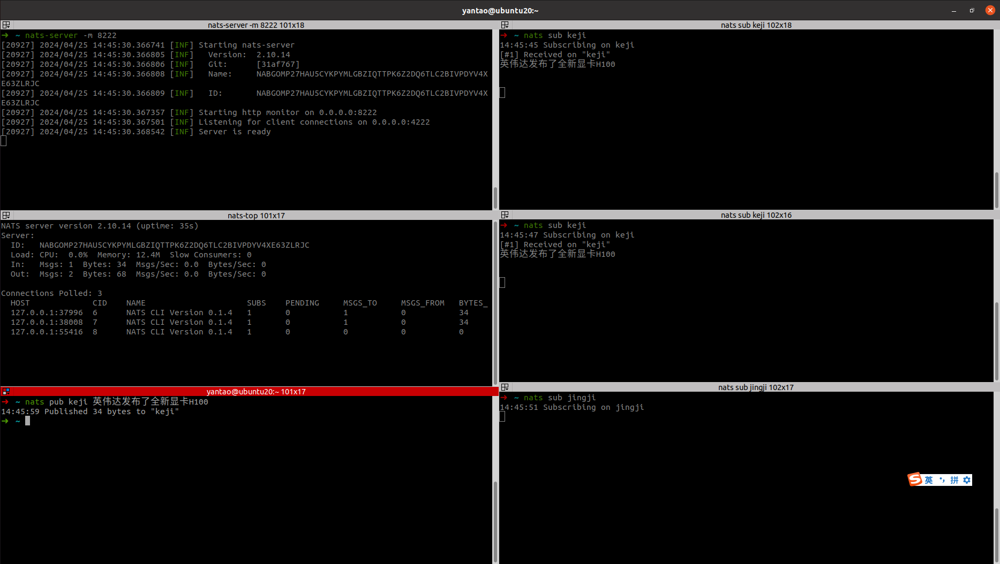
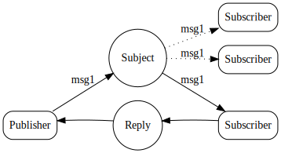
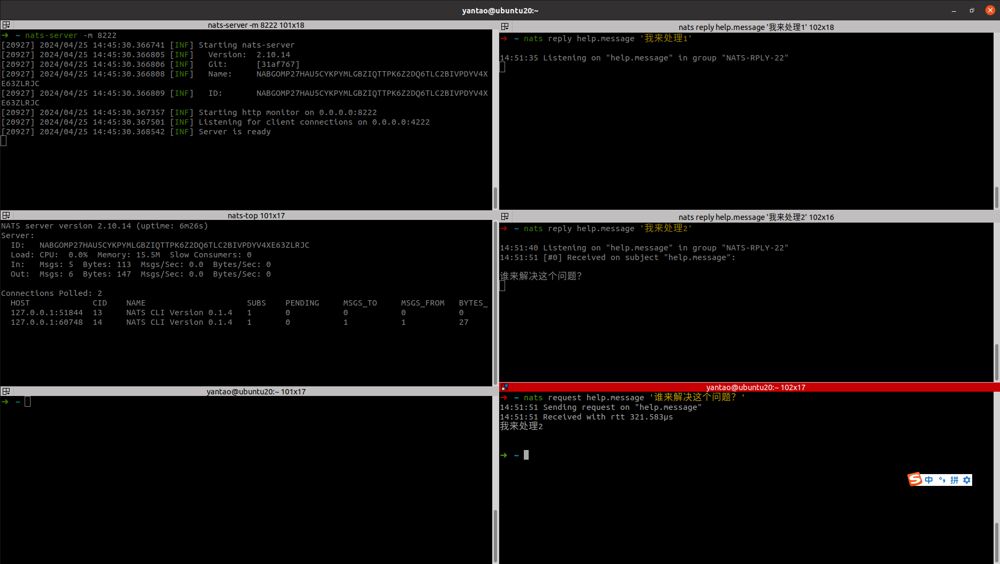
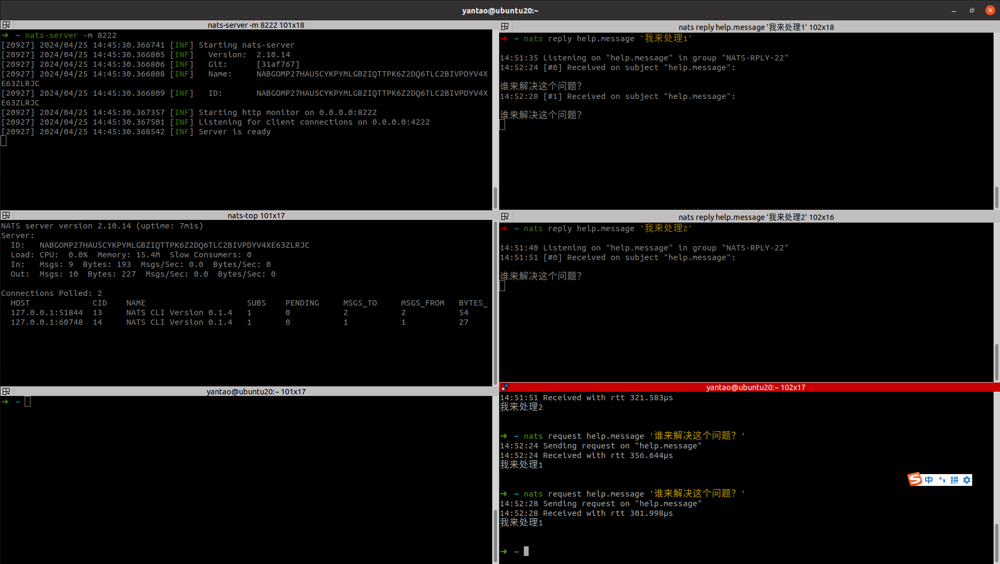
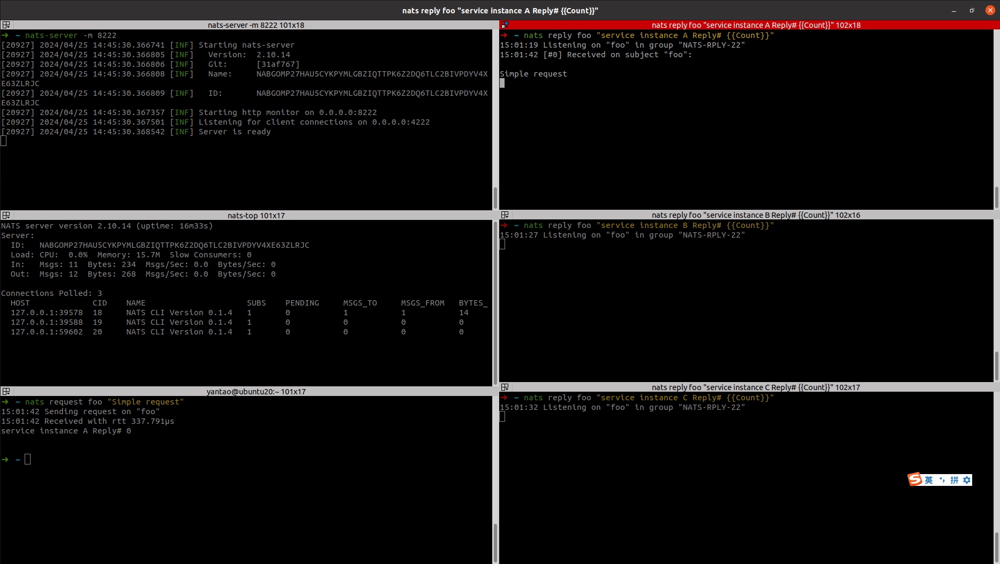
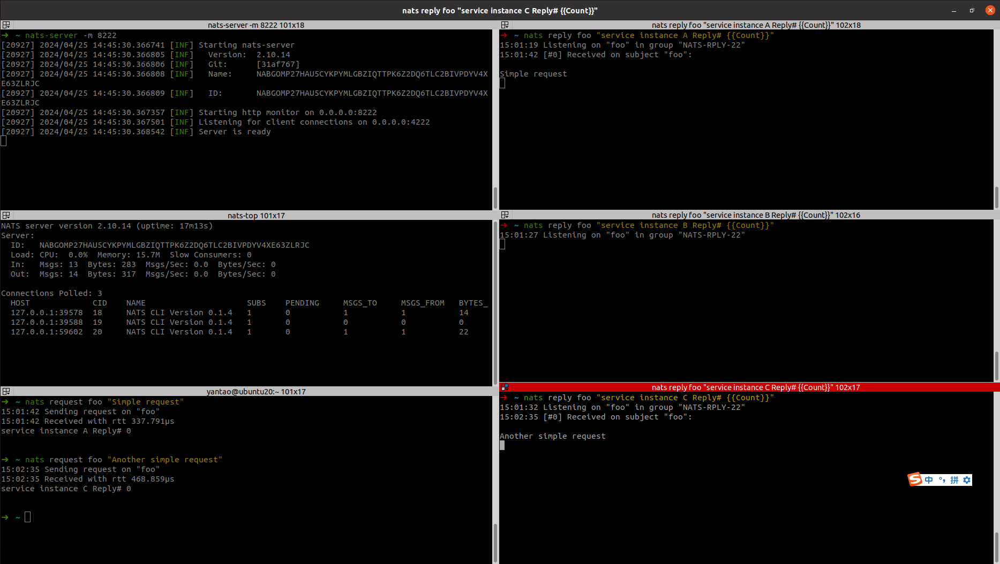
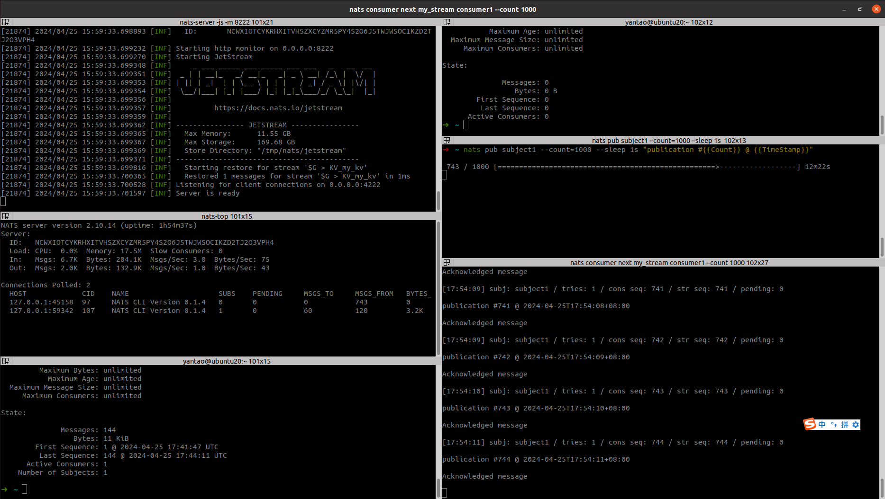

# 1.安装

## 1.安装服务端

https://github.com/nats-io/nats-server/releases

```shell
yantao@ubuntu20:~$ sudo tar -zxvf nats-server-v2.10.14-linux-amd64.tar.gz   

yantao@ubuntu20:~$ sudo mv nats-server-v2.10.14-linux-amd64/nats-server /usr/local/bin 
```

启动服务端 nats-server

```shell
yantao@ubuntu20:~$ nats-server 
[39780] 2024/04/25 13:55:10.572821 [INF] Starting nats-server
[39780] 2024/04/25 13:55:10.572899 [INF]   Version:  2.10.14
[39780] 2024/04/25 13:55:10.572901 [INF]   Git:      [31af767]
[39780] 2024/04/25 13:55:10.572904 [INF]   Name:     NC2BBNMA7FY72AXPNMQDS45VW7PP3EUUWNQIXL3YOQXR6T6G7GWWSO7Z
[39780] 2024/04/25 13:55:10.572907 [INF]   ID:       NC2BBNMA7FY72AXPNMQDS45VW7PP3EUUWNQIXL3YOQXR6T6G7GWWSO7Z
[39780] 2024/04/25 13:55:10.573193 [INF] Listening for client connections on 0.0.0.0:4222
[39780] 2024/04/25 13:55:10.574876 [INF] Server is ready

```


## 2.安装客户端

https://github.com/nats-io/natscli/releases

```shell
yantao@ubuntu20:~$ wget https://github.com/nats-io/natscli/releases/download/v0.1.4/nats-0.1.4-linux-amd64.zip

yantao@ubuntu20:~$ unzip nats-0.1.4-linux-amd64.zip 
Archive:  nats-0.1.4-linux-amd64.zip
  inflating: nats-0.1.4-linux-amd64/LICENSE  
  inflating: nats-0.1.4-linux-amd64/README.md  
  inflating: nats-0.1.4-linux-amd64/nats  
yantao@ubuntu20:~$ sudo mv nats-0.1.4-linux-amd64/nats /usr/local/bin/
#验证
yantao@ubuntu20:~$ nats --version
0.1.4
```


## 3.安装nats-top

```
go install github.com/nats-io/nats-top@latest
```

或者去这里下载安装  https://github.com/nats-io/nats-top/releases/download/v0.6.1/nats-top_0.6.1_linux_amd64.tar.gz 

安装完成之后，先在启用监控的情况下启动 NATS 服务器

```shell
nats-server -m 8222
```

然后启动 nats-top

```shell
nats-top
```

结果

```shell
NATS server version 2.10.14 (uptime: 56s)
Server:
  ID:   NCH5W6PTJXHDZU537ZYXYVWG3YQ3MPE4CPV5N2UBOR3IFLROJLSCZW6Z
  Load: CPU:  0.0%  Memory: 11.1M  Slow Consumers: 0
  In:   Msgs: 0  Bytes: 0  Msgs/Sec: 0.0  Bytes/Sec: 0
  Out:  Msgs: 0  Bytes: 0  Msgs/Sec: 0.0  Bytes/Sec: 0

Connections Polled: 0
  HOST             CID    SUBS    PENDING     MSGS_TO     MSGS_FROM   BYTES_TO    BYTES_FROM  LANG
```

按`q`退出nats-top。


# 2.NATS的三种模式

## 1.发布/订阅

侦听某个主题的订阅者会收到有关该主题发布的消息。如果订阅者未主动侦听主题，则不会收到消息。

当订阅者注册自己来接收来自发布者的消息时，消息传递的 1：N 扇出模式可确保发布者发送的任何消息都能到达已注册的所有订阅者。


消息由以下部分组成：

1. 一个主题。
2. 字节数组形式的有效负载。
3. 任意数量的标头字段。
4. 可选的“回复”地址字段。

消息具有最大大小（在服务器配置中使用 设置）。默认情况下，大小设置为 1 MB，但如果需要，可以增加到 64 MB


1.先创建三个订阅者

```shell
#订阅科技主题
nats sub keji
```

```shell
#订阅科技主题
nats sub keji
```

```shell
#订阅经济主题
nats sub jingji
```


2.发布者

```shell
nats pub keji 英伟达发布了全新显卡H100
14:25:41 Published 34 bytes to "keji"
```


3.可以看到只有订阅了科技主题的订阅者才会收到这条消息，而订阅了经济主题的订阅者没有收到消息。




## 2.请求-回复

请求-回复是现代分布式系统中的常见模式。发送请求，应用程序要么等待具有特定超时的响应，要么异步接收响应。




运行回复客户端的监听者。

```shell
nats reply help.message '我来处理'
```

```shell
[root@localhost ~]# nats request help.message '谁来解决这个问题？'
15:00:45 Sending request on "help.message"
15:00:45 Received with rtt 649.899µs
我来处理
```





当有多个回复者的时候，只有一个做出回复。




## 3.消息队列

如果将更多订阅者添加到同一队列名称中，则它们将成为队列组，并且每次队列组收到消息时，队列组中只有一个随机选择的订阅者将使用一条消息。这种分布式队列是 NATS 提供的内置负载平衡功能。

**优势**

- 确保应用程序容错
- 工作负载处理可以纵向扩展或缩减
- 无需额外配置
- 队列组由应用程序及其队列订阅者定义，而不是由服务器配置定义


启动队列组的第一个成员

```shell
nats reply foo "service instance A Reply# {{Count}}"
```

启动队列组的第一个成员

```shell
nats reply foo "service instance B Reply# {{Count}}"
```

启动队列组的第一个成员

```shell
nats reply foo "service instance C Reply# {{Count}}"
```


发布 NATS 消息

```shell
nats request foo "Simple request"	
```





发布另一条消息

```shell
nats request foo "Another simple request"
```





# 3.jetstream

https://docs.nats.io/nats-concepts/jetstream

NATS 有一个内置的分布式持久性系统，称为 [JetStream](https://docs.nats.io/using-nats/developer/develop_jetstream)，它在基本的“核心 NATS”功能和服务质量之上支持新功能和更高的服务质量。

## 持久且一致的分布式存储

您可以根据需要选择消息存储的持久性和弹性。

- 内存存储。
- 文件存储。
- 在 nats 服务器之间复制（1（无）、2、3）以实现 Fault Tolerance。


## 键值存储

JetStream 是一个持久层，流式处理只是构建在该层之上的功能之一。

另一个功能是 JetStream 键值存储：能够存储、检索和删除与*键*关联*的值*消息，监视（侦听）该键发生的更改，甚至检索特定键上发生的值（和删除）的历史记录。


## 演练


### 1.启用 JetStream

```
nats-server -js -m 8222
```

```shell
[21874] 2024/04/25 15:59:33.698810 [INF] Starting nats-server
[21874] 2024/04/25 15:59:33.698883 [INF]   Version:  2.10.14
[21874] 2024/04/25 15:59:33.698887 [INF]   Git:      [31af767]
[21874] 2024/04/25 15:59:33.698889 [INF]   Name:     NCWXIOTCYKRHXITVHSZXCYZMR5PY4S2O6J5TWJWSOCIKZD2TJ2O3VPH4
[21874] 2024/04/25 15:59:33.698892 [INF]   Node:     Clo0H1X7
[21874] 2024/04/25 15:59:33.698893 [INF]   ID:       NCWXIOTCYKRHXITVHSZXCYZMR5PY4S2O6J5TWJWSOCIKZD2TJ2O3VPH4
[21874] 2024/04/25 15:59:33.699232 [INF] Starting http monitor on 0.0.0.0:8222
[21874] 2024/04/25 15:59:33.699270 [INF] Starting JetStream
[21874] 2024/04/25 15:59:33.699348 [INF]     _ ___ _____ ___ _____ ___ ___   _   __  __
[21874] 2024/04/25 15:59:33.699351 [INF]  _ | | __|_   _/ __|_   _| _ \ __| /_\ |  \/  |
[21874] 2024/04/25 15:59:33.699353 [INF] | || | _|  | | \__ \ | | |   / _| / _ \| |\/| |
[21874] 2024/04/25 15:59:33.699354 [INF]  \__/|___| |_| |___/ |_| |_|_\___/_/ \_\_|  |_|
[21874] 2024/04/25 15:59:33.699356 [INF] 
[21874] 2024/04/25 15:59:33.699357 [INF]          https://docs.nats.io/jetstream
[21874] 2024/04/25 15:59:33.699359 [INF] 
[21874] 2024/04/25 15:59:33.699362 [INF] ---------------- JETSTREAM ----------------
[21874] 2024/04/25 15:59:33.699365 [INF]   Max Memory:      11.55 GB
[21874] 2024/04/25 15:59:33.699367 [INF]   Max Storage:     169.68 GB
[21874] 2024/04/25 15:59:33.699369 [INF]   Store Directory: "/tmp/nats/jetstream"
[21874] 2024/04/25 15:59:33.699371 [INF] -------------------------------------------
[21874] 2024/04/25 15:59:33.699816 [INF]   Starting restore for stream '$G > KV_my_kv'
[21874] 2024/04/25 15:59:33.700365 [INF]   Restored 1 messages for stream '$G > KV_my_kv' in 1ms
[21874] 2024/04/25 15:59:33.700528 [INF] Listening for client connections on 0.0.0.0:4222
[21874] 2024/04/25 15:59:33.701597 [INF] Server is ready

```


使用nats-top监控

```shell
NATS server version 2.10.14 (uptime: 1h20m36s)
Server:
  ID:   NCWXIOTCYKRHXITVHSZXCYZMR5PY4S2O6J5TWJWSOCIKZD2TJ2O3VPH4
  Load: CPU:  1.0%  Memory: 16.8M  Slow Consumers: 0
  In:   Msgs: 1.9K  Bytes: 78.8K  Msgs/Sec: 0.0  Bytes/Sec: 0
  Out:  Msgs: 353  Bytes: 48.9K  Msgs/Sec: 0.0  Bytes/Sec: 0

Connections Polled: 0
  HOST             CID    SUBS    PENDING     MSGS_TO     MSGS_FROM   BYTES_TO    BYTES_FROM  LANG

```


### 2.创建流

```
nats stream add my_stream --subjects subject1
```

输入（在下面的示例中，我们将流命名为“my_stream”），然后输入“subjects”作为主题名称，并按回车键以使用所有其他流属性的默认值

```shell
? Storage file
? Replication 1
? Retention Policy Limits
? Discard Policy Old
? Stream Messages Limit -1
? Per Subject Messages Limit -1
? Total Stream Size -1
? Message TTL -1
? Max Message Size -1
? Duplicate tracking time window 2m0s
? Allow message Roll-ups No
? Allow message deletion Yes
? Allow purging subjects or the entire stream Yes
Stream my_stream was created
```

上面各个选项含义

```shell
存储类型：内存（memory）
副本数：1
保留策略：限制（Limits）
抛弃策略：旧消息（Old）
流消息限制：无限制（-1）
每个主题的消息限制：无限制（-1）
总流大小限制：无限制（-1）
消息TTL（生存时间）：无限制（-1）
最大消息大小：无限制（-1）
重复消息跟踪时间窗口：2分钟
允许消息汇总：否
允许消息删除：是
允许清除主题或整个流：是
```


### 3.将消息发布到流中

```shell
nats pub subject1 --count=1000 --sleep 1s "publication #{{Count}} @ {{TimeStamp}}"
```

当消息以主题“subject1”发布时，它们也会被捕获并存储在流中，您可以使用`nats stream info my_stream` 来检查stream。

```shell
nats stream info my_stream
```

```
State:

              Messages: 39
                 Bytes: 3.1 KiB
        First Sequence: 1 @ 2024-04-25 17:24:49 UTC
         Last Sequence: 39 @ 2024-04-25 17:25:27 UTC
      Active Consumers: 0
    Number of Subjects: 1

```

还可以查看消息本身

```shell
nats stream view my_stream
```

```shell
[1] Subject: subject1 Received: 2024-04-25T17:24:49+08:00

publication #1 @ 2024-04-25T17:24:49+08:00


[2] Subject: subject1 Received: 2024-04-25T17:24:50+08:00

publication #2 @ 2024-04-25T17:24:50+08:00


[3] Subject: subject1 Received: 2024-04-25T17:24:51+08:00

publication #3 @ 2024-04-25T17:24:51+08:00


[4] Subject: subject1 Received: 2024-04-25T17:24:52+08:00

publication #4 @ 2024-04-25T17:24:52+08:00


[5] Subject: subject1 Received: 2024-04-25T17:24:53+08:00

publication #5 @ 2024-04-25T17:24:53+08:00


[6] Subject: subject1 Received: 2024-04-25T17:24:54+08:00

publication #6 @ 2024-04-25T17:24:54+08:00


[7] Subject: subject1 Received: 2024-04-25T17:24:55+08:00

publication #7 @ 2024-04-25T17:24:55+08:00


[8] Subject: subject1 Received: 2024-04-25T17:24:56+08:00

publication #8 @ 2024-04-25T17:24:56+08:00


[9] Subject: subject1 Received: 2024-04-25T17:24:57+08:00

publication #9 @ 2024-04-25T17:24:57+08:00


[10] Subject: subject1 Received: 2024-04-25T17:24:58+08:00

publication #10 @ 2024-04-25T17:24:58+08:00


? Next Page? (Y/n) 


```


### 3.创建消费者

```shell
nats consumer add  
```

```shell
nats consumer add  
? Consumer name consumer1
? Delivery target (empty for Pull Consumers) 
? Start policy (all, new, last, subject, 1h, msg sequence) all
? Acknowledgment policy explicit
? Replay policy instant
? Filter Stream by subjects (blank for all) 
? Maximum Allowed Deliveries -1
? Maximum Acknowledgments Pending 0
? Deliver headers only without bodies No
? Add a Retry Backoff Policy No
? Select a Stream my_stream
Information for Consumer my_stream > consumer1 created 2024-04-25T17:33:39+08:00

```

消费者的详细配置：

```shell
Consumer Name: consumer1
Delivery Target: 未特别指定，这意味着您创建的是一个Pull Consumer，消费者需要主动拉取消息。
Start Policy: all，消费者将从流的最开始处接收消息，或者如果之前有消费过，则从上次消费的位置继续。
Acknowledgment Policy: explicit，消费者需要明确地发送确认（ACK）来告知服务器消息已被处理。
Replay Policy: instant，消费者请求的消息会尽快得到回复，没有额外的延迟。
Filter Stream by subjects: 未设置，因此消费者将接收与流关联的所有主题上的消息。
Maximum Allowed Deliveries: -1，表示消息没有最大重试限制，服务器会持续尝试投递直到消息被确认。
Maximum Acknowledgments Pending: 0，这个设置可能需要确认，因为它通常用于限制未完成确认的消息数量，设置为0可能不符合预期，通常应设置一个正整数来限制并发未确认消息的数量，以避免消息积压或资源耗尽。
Deliver Headers Only Without Bodies: No，消费者接收完整的消息体和头部信息。
Retry Backoff Policy: 未添加，消费者不会在重试失败的消息之间自动增加延迟。

```


### 4.从消费者那里订阅


```
nats consumer next my_stream consumer1 --count 1000
```

在此示例中，我们将创建一个具有“持久”名称的拉取使用者，这意味着可以在任意数量的使用进程之间共享该使用者。例如，您可以启动两个实例，每个实例的消息计数为 500，而不是运行单个消息计数为 1000 的消息

1. **持久性(Durability)**: 通过分配一个唯一的“durable name”给消费者，即使消费者离线或因某种原因重启，它也能从上次断开的地方继续接收消息，而不是从头开始或者丢失已分配给它的消息。这对于需要保证消息处理的幂等性或者在分布式系统中维持消息处理状态非常有用。
2. **共享消费**: 有了持久化的消费者，你可以启动多个实例来并行处理来自同一主题的消息。每个实例都会基于服务器的负载均衡策略和你配置的消费策略来获取和处理消息部分。这意味着，如果你有两个消费者实例，每个设置为处理500条消息，服务器会智能地分配消息，确保两个实例合计处理完1000条消息，而不会有任何消息被重复处理或遗漏。这种能力非常适合水平扩展消费能力，提高消息处理的吞吐量。
3. **灵活性与容错**: 持久化的消费者允许系统更加灵活和容错。如果某个消费者实例失败，其他实例可以继续处理消息，确保服务的连续性。此外，当需要添加更多处理能力或在维护期间转移负载时，只需简单地启动或停止消费者实例即可，无需担心消息的错乱或丢失。

综上所述，通过为pull消费者指定一个“durable name”，你不仅定义了一个可以在多个进程或实例间共享的订阅点，还构建了一个能够弹性伸缩和高可用的消息处理架构。这对于构建可扩展的、高容错性的分布式系统是至关重要的。





# 4.nats性能测试

https://docs.nats.io/using-nats/nats-tools/nats_cli/natsbench


