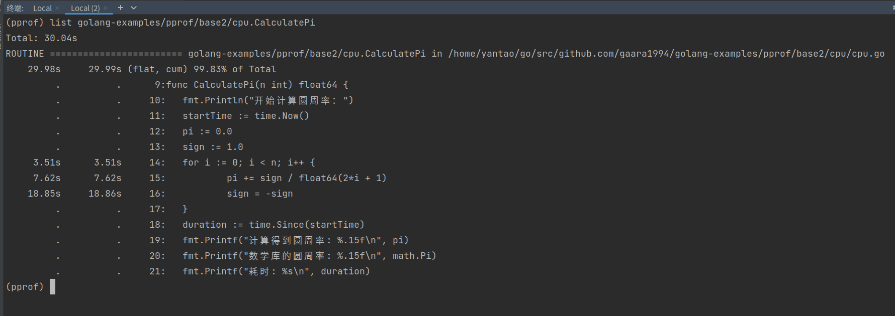
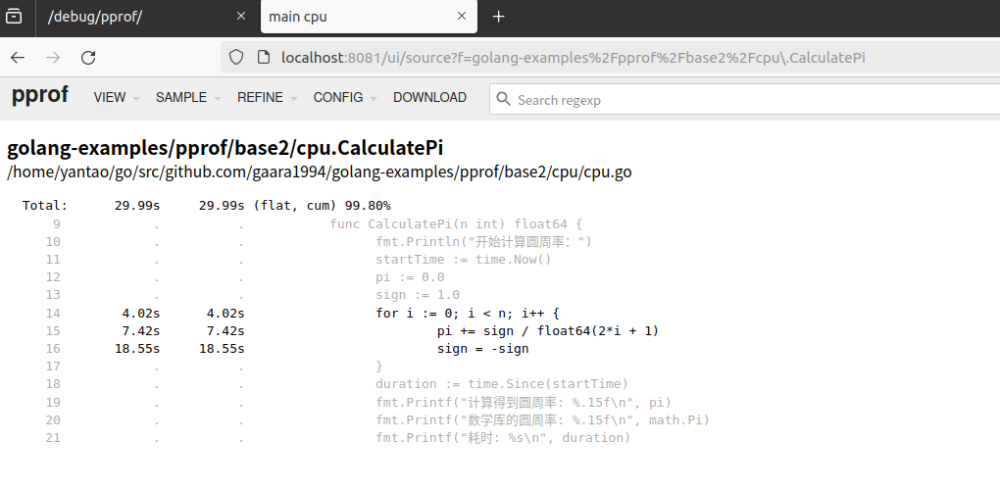
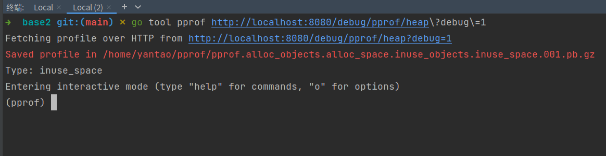
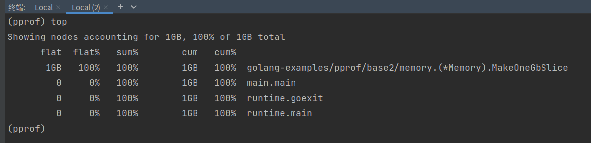

# pprof基本使用

## 1.安装

```shell
go install github.com/google/pprof@latest
```


## 2.引入程序

```go
package main

import (
	"fmt"
	"net/http"
	_ "net/http/pprof" // 导入pprof包，但因为是匿名导入，所以不会自动注册处理器
)

func main() {
	// 监听地址格式是 ":8080"
	if err := http.ListenAndServe(":8080", nil); err != nil {
		// 处理错误
		fmt.Println("http.ListenAndServe :",err)
	}
	// http://localhost:8080/debug/pprof/
}
```


## 3.启动程序

```shell
go run main.go
```

打开页面：http://localhost:8080/debug/pprof/


```go
/debug/pprof/	#主路由
Set debug=1 as a query parameter to export in legacy text format


Types of profiles available:
//数量   类型&路由链接
Count	Profile
5	allocs		//显示内存分配情况的剖析数据，反映程序中分配了多少内存以及分配的位置。
0	block		//显示 goroutine 阻塞情况，需要先通过runtime.SetBlockProfileRate设置采样率。
0	cmdline		//提供当前程序的命令行参数信息。
6	goroutine	//显示当前所有goroutine的堆栈信息，有助于分析goroutine的状态和数量。
5	heap		//提供堆内存使用情况的剖析数据，展示内存分配和存活对象的信息。
0	mutex		//显示互斥锁的竞争情况，需要先通过runtime.SetMutexProfileFraction设置采样率。
0	profile		//用于获取CPU使用情况的剖析数据。可以通过查询参数seconds指定采样时长。默认需等待采样30s
8	threadcreate//显示线程创建情况的剖析数据，有助于理解程序的线程模型和负载
0	trace		//提供执行追踪数据，可以用来分析程序的执行流程和阻塞情况，可通过查询参数seconds指定追踪时长。

```


## 4.采集数据

以cpu举例：


这里采集的是cpu数据，默认是30秒。要等待30秒把文件采集下载到本地。

```shell
go tool pprof http://localhost:8080/debug/pprof/profile\?debug\=1
```


## 5.采集信息文件

由于我们的程序没有负载消耗，所以下面的命令得到的指标没有结果。

### top

cpu使用情况排行

```shell
(pprof) top
Showing nodes accounting for 0, 0% of 0 total
      flat  flat%   sum%        cum   cum%

```


### list

查看指定函数的的使用情况。

### web

生成连线图，并在浏览器查看图片。


### q

退出


# cpu负载代码

编写cpu负载代码

`base2/cpu/cpu.go`

```go
package cpu

import (
	"fmt"
	"math"
	"time"
)

func CalculatePi(n int) float64 {
	fmt.Println("开始计算圆周率：")
	startTime := time.Now()
	pi := 0.0
	sign := 1.0
	for i := 0; i < n; i++ {
		pi += sign / float64(2*i + 1)
		sign = -sign
	}
	duration := time.Since(startTime)
	fmt.Printf("计算得到圆周率: %.15f\n", pi)
	fmt.Printf("数学库的圆周率: %.15f\n", math.Pi)
	fmt.Printf("耗时: %s\n", duration)
	return pi * 4
}

```


`base2/main.go`

```go
package main

import (
	"fmt"
	"golang-examples/pprof/base2/cpu"
	"net/http"
	_ "net/http/pprof" // 导入pprof包，但因为是匿名导入，所以不会自动注册处理器
)

func main() {
	go func() {
		//这个值可以根据需要调整，值越大结果越精确，但计算时间也越长
		//iterations := 10000000000 // 9秒
		iterations := 1000000000000 //16分钟
		pi := cpu.CalculatePi(iterations)
		fmt.Println(pi)
	}()

	if err := http.ListenAndServe(":8080", nil); err != nil {
		// 处理错误
		fmt.Println("http.ListenAndServe :", err)
	}
	// http://localhost:8080/debug/pprof/
}

```


```shell
go tool pprof http://localhost:8080/debug/pprof/profile\?debug\=1
```


### top


可以看到 golang-examples/pprof/base2/cpu.CalculatePi 占用cpu的时间最多。


### list 

查看指定包的信息




### web


# 交互式的性能分析

这种方式会在本地启动一个 HTTP 服务器，并在浏览器中显示性能分析的交互式界面。我们可以通过浏览器直观地浏览性能分析数据，而不必依赖终端界面，而且我们可以将性能分析页面的 URL 分享给其他人，方便团队成员共同分析和解决问题。更为重要的是，`-http` 方式提供了实时更新的功能。当程序在运行时采集数据，浏览器中的页面会及时反映这些数据的变化。	

```shell
go tool pprof -http=:8081  http://localhost:8080/debug/pprof/profile\?debug\=1
```


默认打开连线图：


###  VIEW：

1. top：
   - **作用：** 显示性能分析的顶级函数列表，按照 CPU 使用时间排序。
   - **用途：** 用于查看程序中占用 CPU 时间最多的函数，帮助确定性能瓶颈。
2. graph：
   - **作用：** 生成并显示调用图（call graph）。
   - **用途：** 提供了函数之间调用关系的可视化，有助于理解代码的调用流程。
3. flame Graph：
   - **作用：** 生成并显示火焰图。
   - **用途：** 火焰图是一种可视化工具，直观显示函数调用关系和执行时间，更容易发现性能瓶颈。
4. peek：
   - **作用：** 显示函数的源码和汇编码。
   - **用途：** 提供了在源码和汇编级别查看函数的功能，用于深入分析函数执行过程。
5. source：
   - **作用：** 显示函数的源码。
   - **用途：** 提供了在源码级别查看函数的功能，便于理解代码的具体实现。
6. disassemble：
   - **作用：** 显示函数的汇编码。
   - **用途：** 提供了在汇编级别查看函数的功能，有助于深入了解函数的底层执行过程。

###### 


### SAMPLE 

下的选项：`samples` 和 `cpu` 是两个常用的命令，用于查看不同类型的性能样本信息。

1. samples：
   - **作用：** 表示程序在采样时的状态信息，记录了堆栈跟踪信息和对应的采样计数。
   - **用途：** 用于采样分析，通过收集一系列采样数据，可以了解程序在不同时刻的执行情况，帮助找出热点代码和性能瓶颈。
2. cpu：
   - **作用：** 表示 CPU 使用时间的信息，记录了每个函数的 CPU 使用时间和调用次数。
   - **用途：** 用于 CPU 时间分析，提供了函数级别的 CPU 使用情况，帮助确定哪些函数占用了大量的 CPU 时间，从而找到潜在的性能问题。


REFINE 下的选项：`focus`、`ignore`、`hide`、`show`、`show from`、`reset` 是用于调整视图的命令。它们的作用如下：

1. focus：
   - **作用：** 将视图聚焦于指定的函数，只显示与该函数相关的信息。
   - **用途：** 用于关注某个特定函数，查看与该函数相关的性能信息，便于深入分析该函数的性能状况。
2. ignore：
   - **作用：** 忽略指定函数，不显示与该函数相关的信息。
   - **用途：** 用于排除某些函数，以便在性能分析中聚焦于其他关键函数，减少视图的干扰。
3. hide：
   - **作用：** 隐藏指定函数及其调用图，不显示在视图中。
   - **用途：** 用于在视图中隐藏一些不感兴趣或者不重要的函数，简化视图。
4. show：
   - **作用：** 显示之前被隐藏的函数。
   - **用途：** 用于取消之前使用 `hide` 命令隐藏的函数，重新在视图中显示。
5. show from：
   - **作用：** 从指定函数开始显示调用图。
   - **用途：** 设置一个起始点，从该点开始显示函数的调用图，有助于查看特定路径的调用关系。
6. reset：
   - **作用：** 重置视图，取消之前的 `focus`、`ignore`、`hide` 等操作。
   - **用途：** 用于还原视图到最初的状态，清除之前的调整，重新全面查看性能信息。


###  CONFIG 

下的选项：Save as … 和 Default 是在 Web UI中的一些配置选项。作用如下：

1. **Save as …**: 这个选项允许您保存当前的配置为一个命名的配置文件。配置文件包含了视图布局、颜色方案等信息。通过保存配置，您可以在将来重新加载相同的配置，方便重复使用。
2. **Default**: 这个选项是将当前的配置设置为默认配置。默认配置会在下次打开 `go tool pprof` 时自动加载。这对于您希望在多次运行中使用相同的配置时很有用。


### Download

`Download` 选项允许您下载当前的图形化展示或报告。下载之后，会生成一个 .pb 文件，同样需要配合 go tool pprof 使用。


选择其他方式查看数据


Top


Graph


火焰图


旧版本火焰图


peek


选择函数，查看源码





选择函数，查看peek


# heap负载代码

堆内存

`memory/memory.go`

```go
package memory

import "fmt"

type Memory struct {

}

func (m *Memory)MakeOneGbSlice() {
	fmt.Println("开始创建切片")
	size := 1024 * 1024* 1024
	slice := make([]byte,size)

	for i := range slice {
		slice[i] = 1
	}
	fmt.Println("创建切片结束")
}

```

`base2/main.go`

```go
package main

import (
	"fmt"
	"golang-examples/pprof/base2/cpu"
	"golang-examples/pprof/base2/memory"
	"net/http"
	_ "net/http/pprof" // 导入pprof包，但因为是匿名导入，所以不会自动注册处理器
)

func main() {
	go func() {
		//这个值可以根据需要调整，值越大结果越精确，但计算时间也越长
		//iterations := 10000000000 // 9秒
		iterations := 1000000000000 //16分钟
		pi := cpu.CalculatePi(iterations)
		fmt.Println(pi)
	}()

	//内存测试
	memory := new(memory.Memory)
	memory.MakeOneGbSlice()

	if err := http.ListenAndServe(":8080", nil); err != nil {
		// 处理错误
		fmt.Println("http.ListenAndServe :", err)
	}
	// http://localhost:8080/debug/pprof/
}

```


采集数据



top




list

由于完整的路径有 *，所以使用函数名就行。 


web


交互式


选择一个函数，查看peek


top


火焰图


